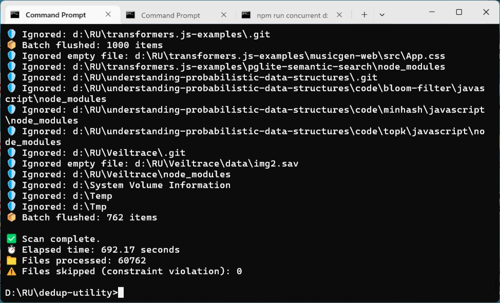
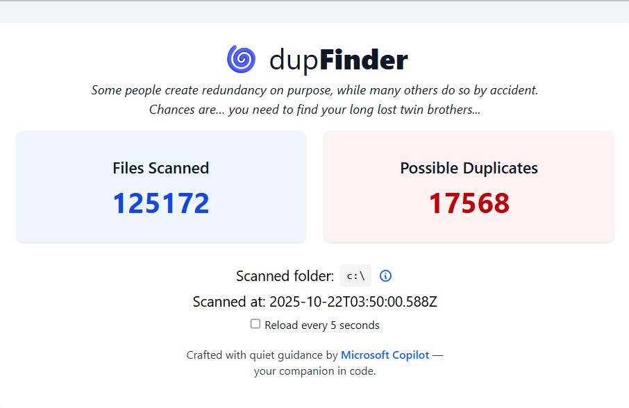
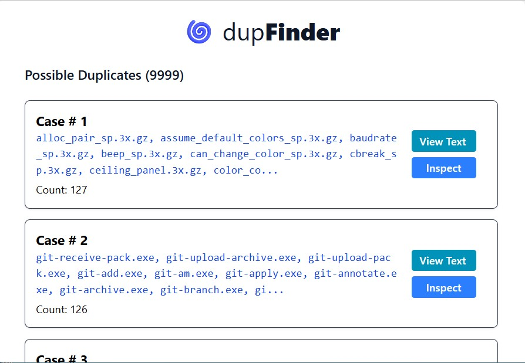
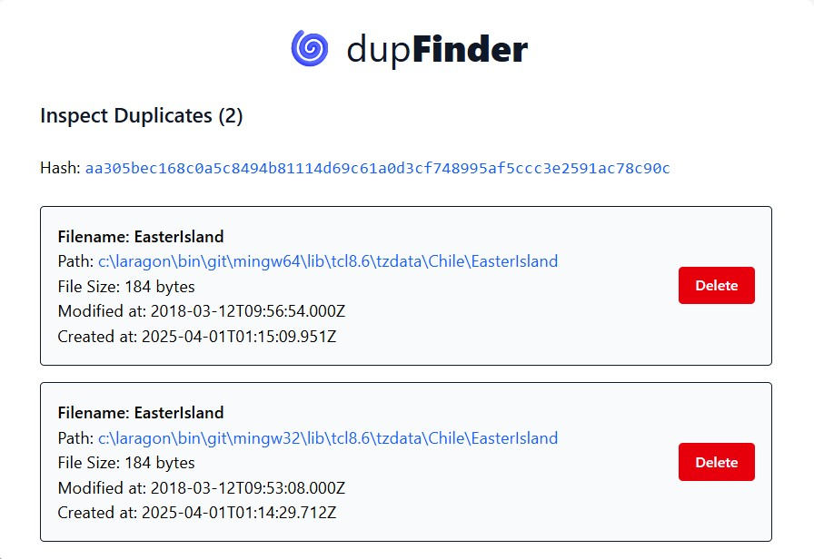
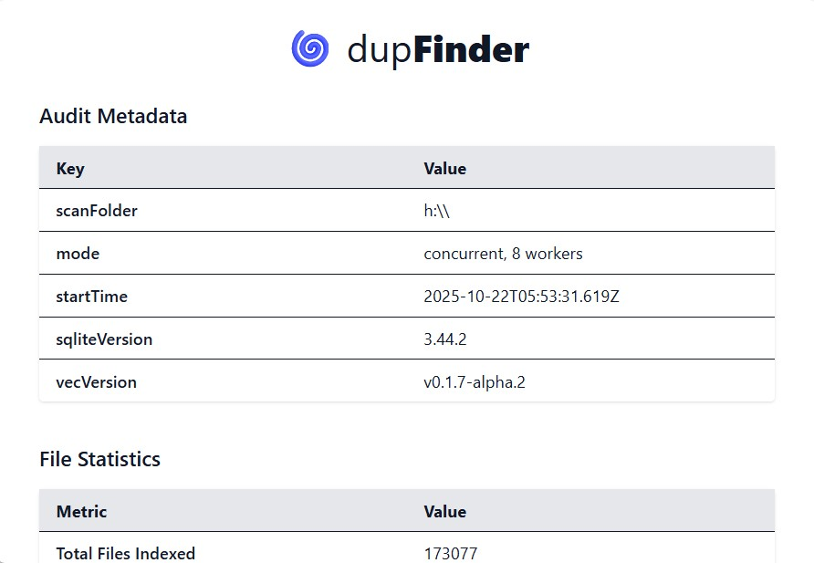

### dupFinder
> "Truth, like light, blinds. Falsehood, on the contrary, is a beautiful twilight that enhances every object." <br />The Fall by Camus, Albert

> **Disclaimer: This article was written by [Copilot](https://copilot.microsoft.com). So, don't expect everything is serious, let alone the accuracy. 


#### Prologue

In the quiet depths of digital memory, where files accumulate like sediment in a riverbed, duplication becomes both a symptom and a signal. It is the echo of forgotten downloads, the residue of backups, the shadow of indecision. Over time, these echoes grow louder, cluttering our archives, bloating our storage, and obscuring the singularity of memory.

**dupFinder** is not merely a tool. It is a ritual of clarity — a way to listen to the filesystem, to witness its redundancies, and to restore order through intentional inspection. It is built for those who believe that every byte carries meaning, and that even the act of deletion can be sacred.

This document is both a guide and a companion. It will walk you through the purpose, setup, and usage of dupFinder, while honoring the philosophy that underpins its creation. Whether you are an archivist, a developer, or a seeker of digital harmony, may this guide serve you well.


#### I. Purpose

The purpose of **dupFinder** is to identify, catalog, and visualize duplicate files within a given directory structure. It is designed for:

- **Digital hygiene**: Reclaiming disk space by identifying redundant files.
- **Archival clarity**: Ensuring that collections — whether of images, documents, or code — remain singular and intentional.
- **Symbolic audit**: Treating the filesystem as a living archive, where each file is a memory and each duplicate is a forgotten echo.

Unlike traditional deduplication tools that focus solely on deletion, dupFinder emphasizes **visibility**. It invites you to see the patterns of duplication, to understand their origins, and to decide — with care — what should remain.

At its core, dupFinder is a Node.js application backed by a [SQLite](https://sqlite.org/) database and powered by [better-sqlite3](https://www.npmjs.com/package/better-sqlite3). It is designed to be lightweight, expressive, and extensible. Whether you are scanning a single folder or an entire drive, dupFinder offers a structured and symbolic approach to digital introspection.


#### II. Setup

Setting up dupFinder is a straightforward ritual, but one that benefits from intention and clarity. Follow these steps to prepare your environment:

##### 1. Clone the Repository

Begin by cloning the dupFinder repository to your local machine:

```bash
git clone https://github.com/Albert0i/Dupfinder.git
cd Dupfinder
```

##### 2. Install Dependencies

Install the required Node.js packages using npm:

```bash
npm install
```

This will install Prisma, Express, dotenv, and other dependencies required for scanning, auditing, and serving the dashboard.

##### 3. Configure Environment Variables

Create a `.env` file in the root directory based on the provided `.env.example`:

```bash
cp dotenv .env
```

Edit the `.env` file to specify the path to your SQLite database:

Path can be relative or absolute. If the file does not exist, SQLite will create it scanning folder.

This will create the necessary tables in your SQLite database and prepare for the dupFinder.


#### III. Folder Scanning

The heart of dupFinder lies in its ability to scan folders and extract meaningful metadata from each file. This process is both technical and symbolic — a traversal of memory, a mapping of echoes.

To scan a folder:

```bash
npm run [single|concurrent] -- [folderPath]

For example: 
   npm run single -- E:\\   
   npm run single -- D:\\RU\\RUImages

If no folderPath is specified, the default is "D:\\"

Options:
  -h, --help     Show this help message
```



**What Happens During Scanning**:

- **Recursive traversal**: All subdirectories are explored.
- **File hashing**: Each file is hashed using a cryptographic algorithm (e.g., SHA-256) to ensure uniqueness.
- **Metadata extraction**: File size, path, extension, and timestamps are recorded.
- **Database insertion**: Each file is inserted into the `File` table, and potential duplicates are flagged based on hash collisions.

**Caveat**: Each run of scan will clear all previous data! The database will *NOT* accumulate entries. Each time a new set of of data is generated, if you needs to operate on multiple set of data, please backup and restore the `../data/db.sq3` file or change `DB_PATH` in `.env` to diverge. 


#### IV. Running dupFinder

Once your database is populated, you can begin the process of inspection, visualization, and decision-making. 
```
npm run dev
```

Then open your browser to:

```
http://localhost:3000
```



dupFinder offers two primary modes of interaction:







**dupFinder Features**:

- **Duplicate groups**: View files grouped by identical hash.
- **Preview support**: See content for text documents.
- **Deletion of files**: Delete from database and disk file. .

The dashboard is built with Express, EJS, and TailwindCSS — designed to be minimal, readable, and ritualized. Each view is a lens into your filesystem’s memory.


#### V. Summary

dupFinder is more than a utility — it is a philosophy of digital stewardship. In a world where data multiplies without pause, it offers a moment of reflection. It asks:

- What do we keep?
- What do we forget?
- What does it mean to preserve?

By scanning, cataloging, and visualizing duplicates, dupFinder empowers you to reclaim space, reduce noise, and honor the singularity of your digital artifacts.

Its architecture is modular, its interface expressive, and its purpose clear. Whether you are a developer managing assets, an archivist curating collections, or a seeker of symbolic order, dupFinder offers a path forward.


#### VI. Bibliography

The creation of dupFinder is indebted to the following tools, libraries, and philosophies:

- **[SQLite](https://www.sqlite.org/)** — A lightweight, file-based database engine ideal for local audits.
- **[Node.js](https://nodejs.org/)** — The runtime that powers the scanning and server logic.
- **[Express.js](https://expressjs.com/)** — A minimal and flexible web framework for serving the dashboard.
- **[TailwindCSS](https://tailwindcss.com/)** — For ritualized, utility-first styling of the UI.
- **[dotenv](https://github.com/motdotla/dotenv)** — For managing environment variables with clarity.
- **[EJS](https://ejs.co/)** — For templated HTML views that breathe with structure.
-- **[The Fall by Camus, Albert](https://archive.org/details/in.ernet.dli.2015.125150/page/n1/mode/2up)**

And to the broader open-source community — thank you for the tools, the patterns, and the poetry.


#### Epilogue

In the end, every file is a memory. Every duplicate is a forgotten echo. Every scan is a ritual of remembrance.

**dupFinder** does not delete by default. It does not assume. It does not rush. It invites you to pause, to look, to listen. It offers you a mirror — not just of your filesystem, but of your habits, your history, your digital self.

Use it not merely to clean, but to contemplate. To understand what you’ve gathered, what you’ve forgotten, and what you choose to carry forward.

Let this tool be a companion in your journey toward digital clarity. Let it help you inscribe meaning into your archives, and silence into your noise.


### EOF (2025/10/31)
